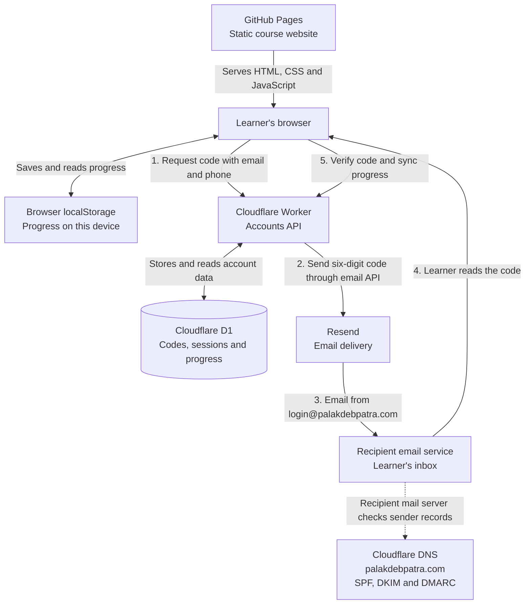

# The Engineering Atlas

**[captainblue793.github.io/palak-engineering-atlas](https://captainblue793.github.io/palak-engineering-atlas/)**

Every interactive engineering course I've written, in one place — **452 chapters (388 main chapters plus a 64-chapter Prerequisites level), ~331 hours,
zero dependencies**. No walls of text: every chapter has animated diagrams, simulators you can
break, an interview drill and a quiz. It all runs in your browser, offline, with no account and
no build step.

| Course | Chapters | Covers |
|---|---|---|
| **[System Design](system-design/)** | 8 prerequisites + 42 | Caching, sharding, queues, consensus, multi-region — plus 17 case studies |
| **[ML & AI Systems](ml-ai-systems/)** | 8 prerequisites + 52 | Transformers, RAG, agents, distributed training, inference, MLOps |
| **[DSA](dsa/)** | 8 prerequisites + 56 | Every structure and algorithm, in one consistent C++ house style |
| **[Low-Level Design](lld/)** | 8 prerequisites + 46 | SOLID, design patterns, concurrency and 16 case studies in Java |
| **[OS & Concurrency](os/)** | 8 prerequisites + 48 | Processes, virtual memory, file systems, locks, epoll and containers in C — plus 8 case studies |
| **[Computer Networks](networks/)** | 8 prerequisites + 48 | TCP/IP layer by layer, DNS, TLS, HTTP/2 and 3, BGP, CDNs and packet-level debugging in Python and the CLI — plus 8 case studies |
| **[Database Internals & SQL](databases/)** | 8 prerequisites + 48 | SQL from the first SELECT, then pages, B-trees and LSM trees, query plans, WAL, MVCC, replication and sharding in PostgreSQL and Python — plus 8 case studies |
| **[Distributed Systems](distributed-systems/)** | 8 prerequisites + 48 | Clocks, replication, quorums, Paxos and Raft, two-phase commit, CRDTs, Kafka and stream processing in Java — plus 8 case studies |

**On the way:** Cloud & DevOps — see [the plan](docs/superpowers/specs/2026-09-30-atlas-expansion-design.md). The Atlas home
page also suggests an order through the courses for each kind of role.


## Optional accounts

Learners can sign in with **email + phone** and a one-time code (sent by email) to sync progress across
devices. The configured backend is a Cloudflare Worker + D1 database in `api/`, with Resend delivering
sign-in emails — see **[ACCOUNTS.md](ACCOUNTS.md)** for how it works and the setup steps.

### Website, accounts and email workflow

The website is hosted on **GitHub Pages**. Its JavaScript calls the account API at
`https://atlas-accounts-api.atlas-accounts-api.workers.dev`. Your domain **`palakdebpatra.com`**
provides the email identity: sign-in codes are sent from **`login@palakdebpatra.com`**.



**DNS is the public directory for your domain.** Cloudflare manages its records; SPF identifies
authorized email senders, DKIM lets receiving mail servers verify email signatures, and DMARC tells
them how to handle authentication failures. The current DMARC policy, `p=none`, requests monitoring
without requiring rejection or quarantine.

The custom domain is used for sending email; the website and API use the addresses above.
Without signing in, progress stays in the browser. After signing in, the Worker syncs it with D1
so the learner can continue on another device. Codes expire after five minutes; the phone number
is part of the account identity, and codes are delivered by email.

```
palak-engineering-atlas/
├── index.html          ← the Atlas (start here)
├── assets/atlas.js     ← the COURSES registry + hub runtime
├── system-design/      ← each course is a self-contained site
├── ml-ai-systems/
├── dsa/
├── lld/
├── os/
├── networks/
├── databases/
└── distributed-systems/
```

## What the Atlas adds

The courses are **not** merged into one file — each stays a standalone site with its own sidebar,
search, progress, glossary, flashcards and mock-interview room. The Atlas joins them at the
entry point:

- **Combined progress** — reads each course's own `localStorage` key (`sd-done`, `ml-done`,
  `dsa-done`, `lld-done`), so ticking a chapter off inside a course shows up on the hub, and vice versa.
  The chapter mosaic on the home page is one square per chapter, all 228 of them.
- **Resume** — deep-links to the next unread chapter of whichever course you're furthest into.
- **Cross-course search** — `Ctrl+K` (or `/`) searches ~3,500 chapter, section and demo entries
  across every released course at once, filterable by course, deep-linking to the exact anchor.
  The indexes load lazily after first paint, so the page opens instantly.
- **Shared theme** — the toggle writes every course's theme key, so it carries across.

## Running it

Open `index.html` in a browser. That's it — no install, no server, no build step.

Each course also builds into a single self-contained HTML file you can keep offline:

```bash
cd system-design && node build.js    # -> dist/system-design-course.html
```

Re-run that after editing any chapter in that course, and commit the `dist/` file.

## Adding a course

Everything on the hub is derived from the `COURSES` array at the top of `assets/atlas.js`.
Drop the course folder next to the others (use a url-safe slug) and add one object — cards,
progress, the mosaic, search, filters, study-tool links and the hero counts all pick it up.
Optionally add it to a track in `PATHS` just below. The full field list is documented in that
file's header comment.

A course only needs the house layout for this to work: `index.html`, `glossary.html`,
`flashcards.html`, `mock-interview.html`, numbered chapter files, and an `assets/study-data.js`
that sets `window.<INDEX_VAR>` to `[{ n, f, ti, lv, e: [{ t, a, k }] }]`.

## History

These three courses previously lived in their own repositories
([system design](https://github.com/CaptainBlue793/palak-system-design-playlist),
[ML & AI systems](https://github.com/CaptainBlue793/palak_ML_AI_system_playlist),
[DSA](https://github.com/CaptainBlue793/palak-DSA-playlist)). Those are archived and kept only
so existing links keep working.

---

Written by **Palak Deb Patra**.
